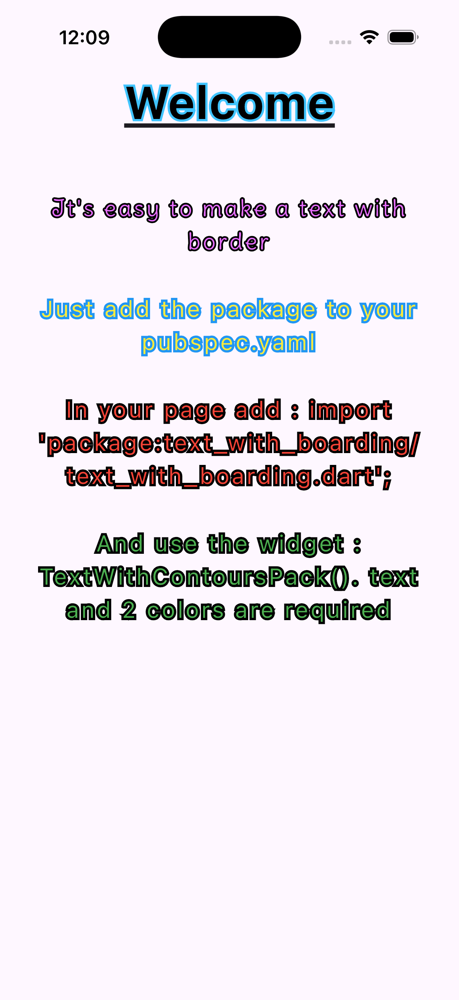

# Text With Outline

A Flutter package that allows you to easily create text with customizable contours (strokes) and interior styles. Perfect for titles, games, or any UI that needs text to pop!



## Features

- **TextWithContours**: Create text with a specific contour color and interior color.
- **TextWithContoursTextStyle**: Use a full `TextStyle` for the interior, allowing for gradients, shadows, and more, while keeping the contour.
- Customizable stroke width.
- Supports custom fonts.

## Getting started

Add the package to your `pubspec.yaml`:

```yaml
dependencies:
  text_with_outline: ^0.0.1
```

## Usage


### Basic Usage (TextWithContours)

Simple text with a solid contour and solid interior color.

```dart
import 'package:text_with_outline/text_with_outline.dart';

TextWithContours(
  enterText: "Hello World",
  colorContour: Colors.black,
  colorInterior: Colors.white,
  fontSize: 40,
  strokeWidth: 4,
  fontFamily: 'YourCustomFont', // Optional
)
```

### Advanced Usage (TextWithContoursTextStyle)

Use a `TextStyle` to define the look of the text inside the contour.

```dart
import 'package:text_with_outline/text_with_outline.dart'; more details, check out the example or the API documentation.
```
